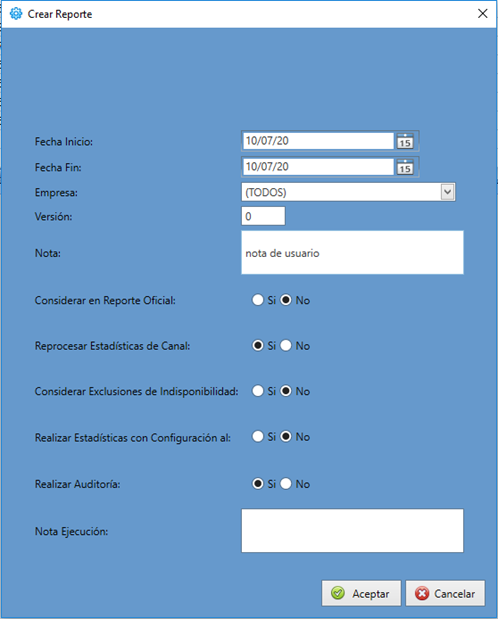
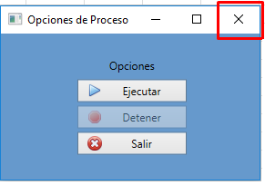
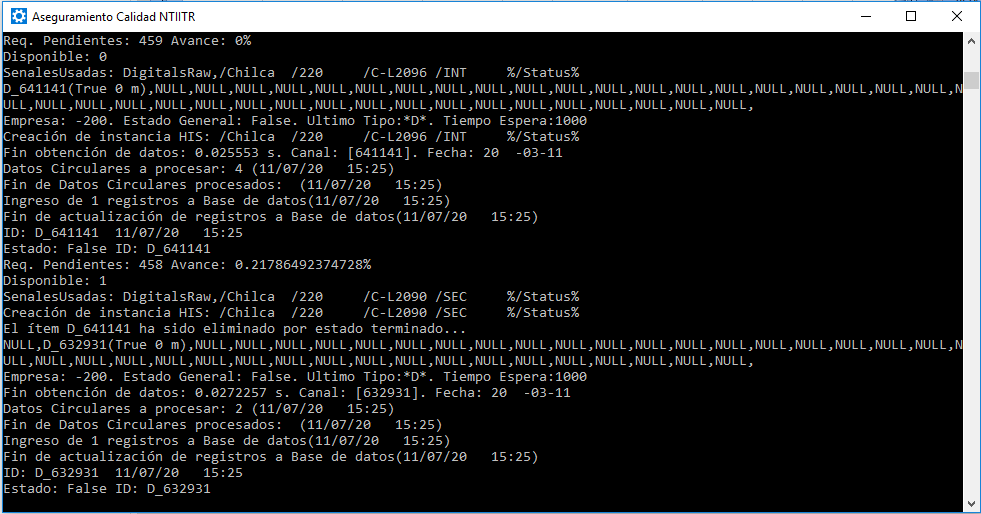
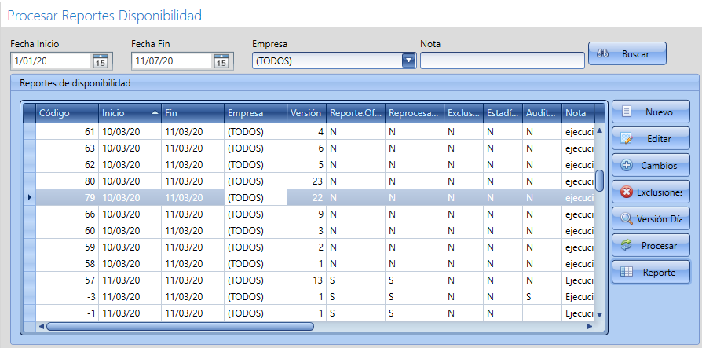
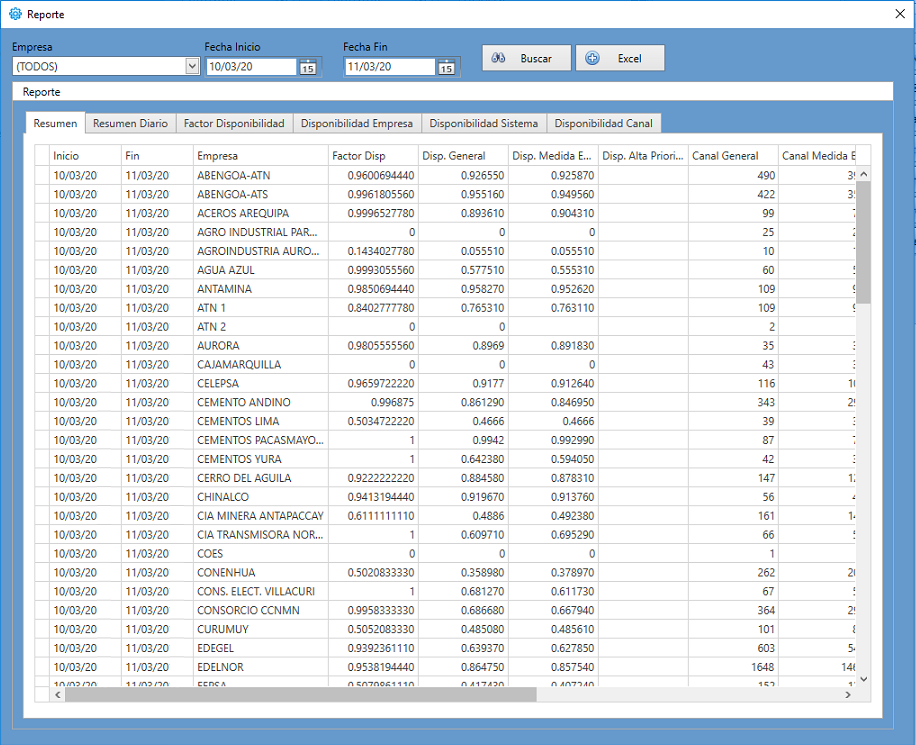
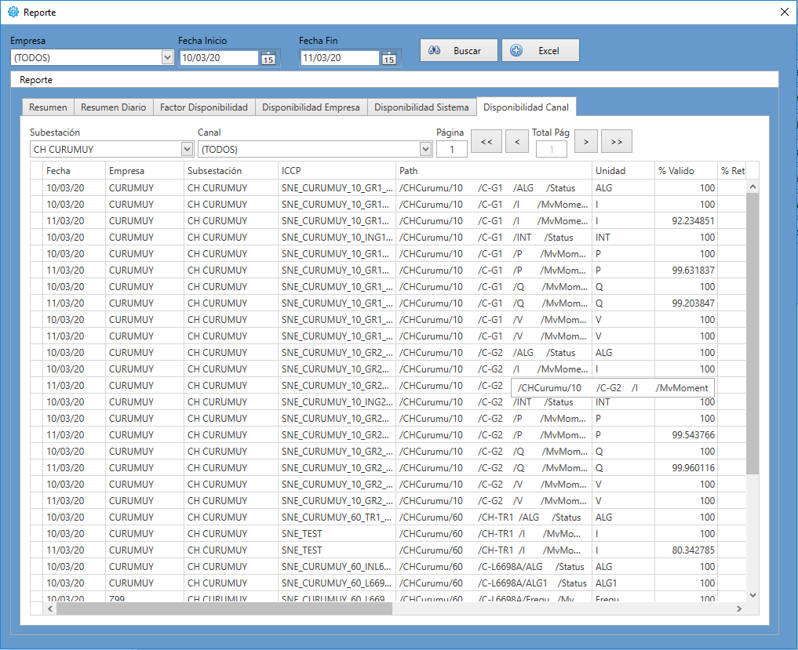
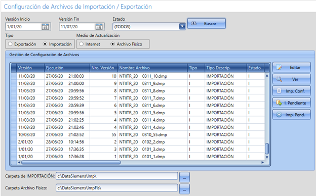

**Development and implementation of an application to ensure the quality of availability index defined in the NTIITR - Technical
Standard for the Exchange of Information in Real Time**

**Main**

**Configuration Detail**

**Exclusions**

**Process Options**

**Data Processing**

**Availability Report**

**Report Detail**

**Daily Summary Report**

**Daily Summary Report - Availability Factor**

**Daily Summary Report - Availability by Company**

**Daily Summary Report - Availability by Channel**

**File Configuration**

**File Configuration - Export**

**Parameter Configuration**

