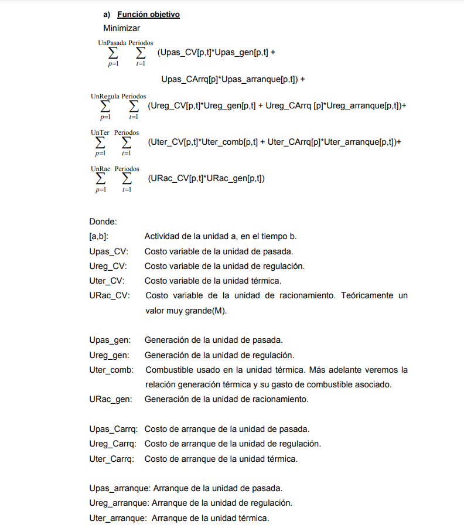
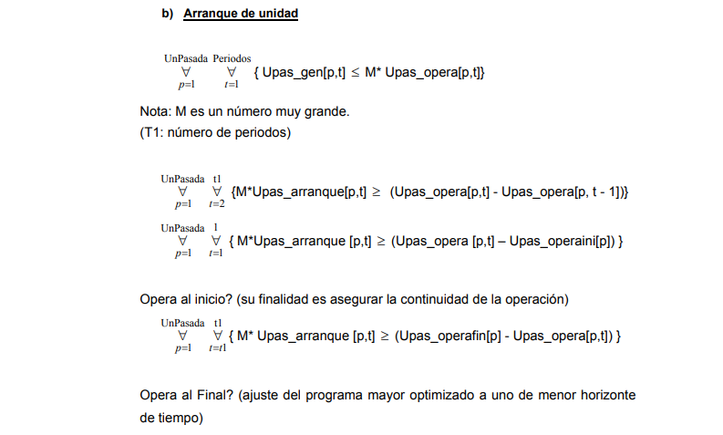
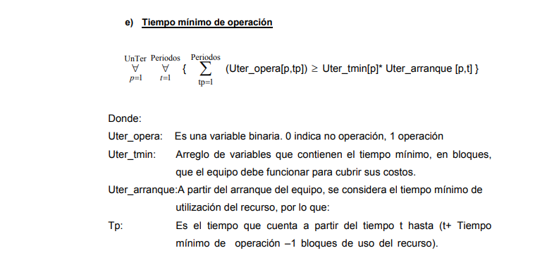
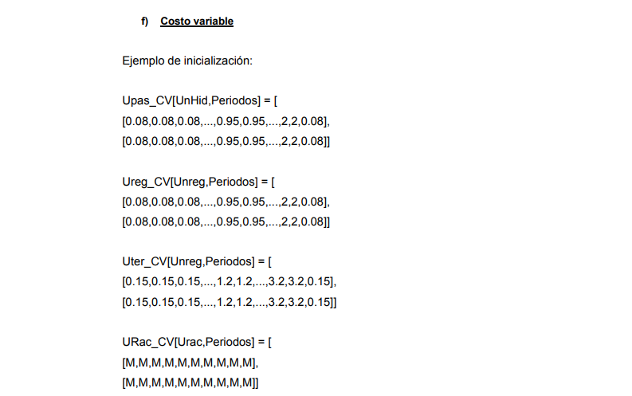
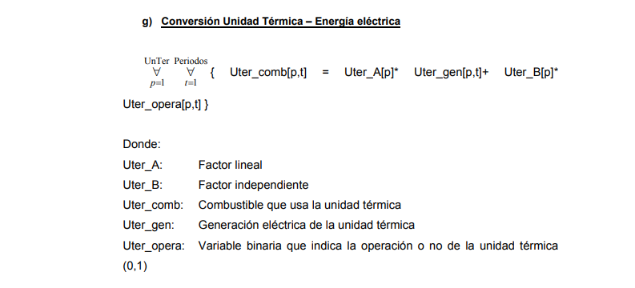
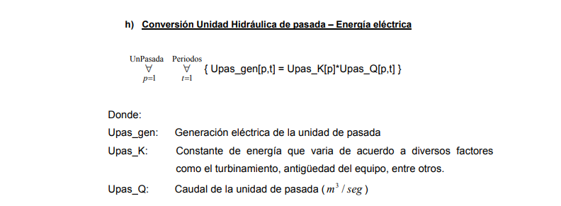
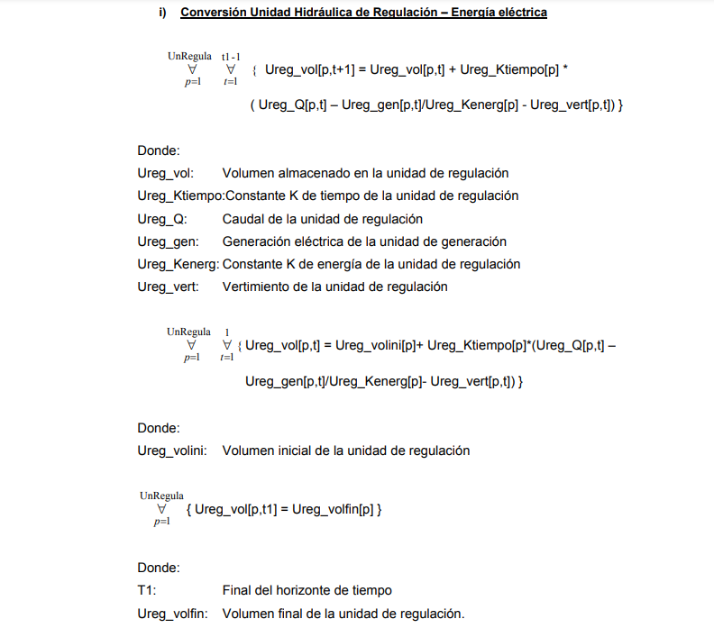
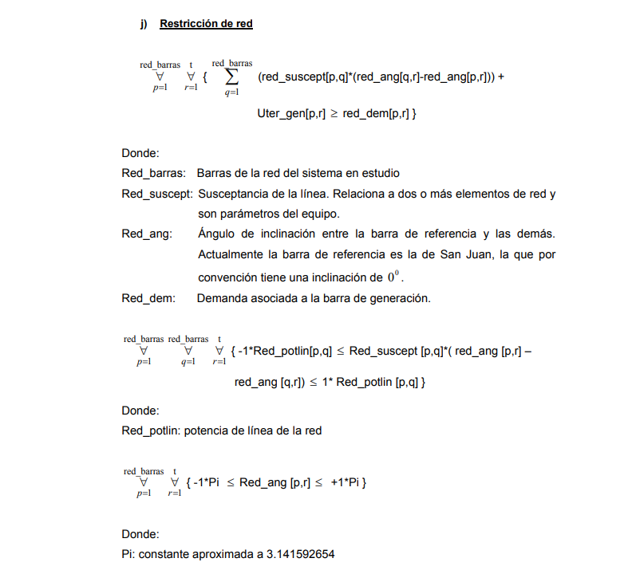

**Operations Research**

Operations Research applied in Electric System

**Objective Function**

**Unit Start**

**Initial and Final Operation**

**Operation Range**

**Minimum Operating Time**

**Variable Cost**

**Thermoelectric Unit Conversion**

**Run Of The River Hydroelectric Unit Conversion**

**Hydroelectric Unit Conversion**

**Network Restriction**

**Reserve**

