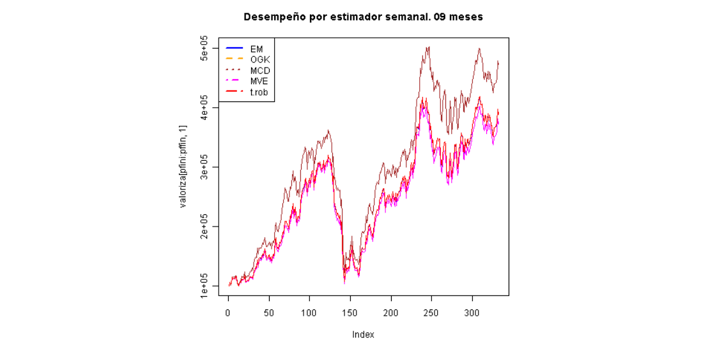
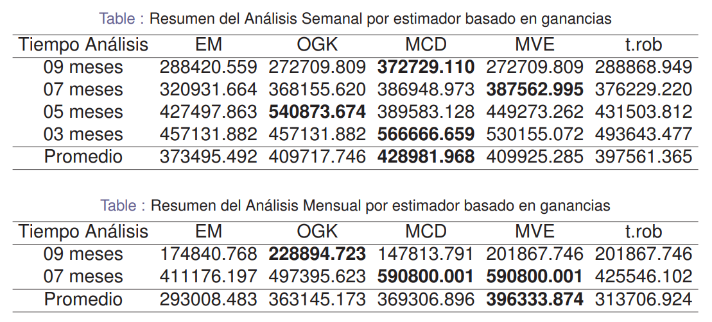

**Statistics in Optimal Financial Portfolios**

Statistics applied to Optimal Financial Portfolios under Classical and Bayesian Robust Estimation

**Application**

**Performance by Estimator**

**Summary**

(EM: classic estimator)