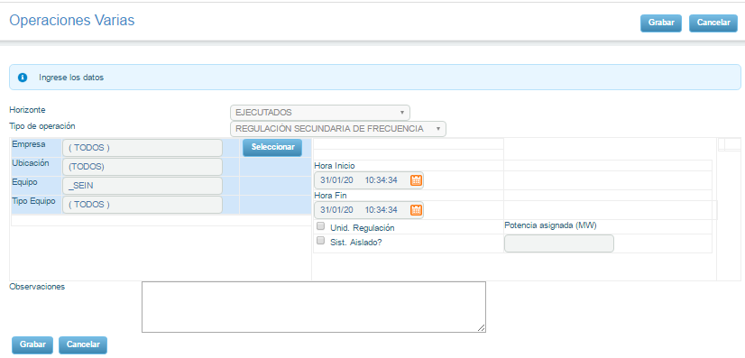
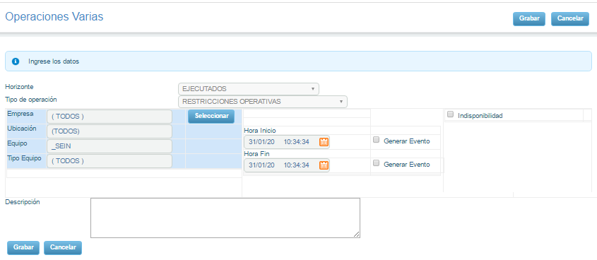
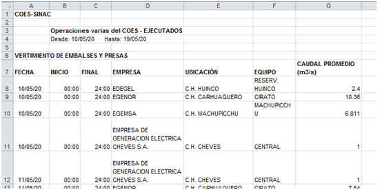
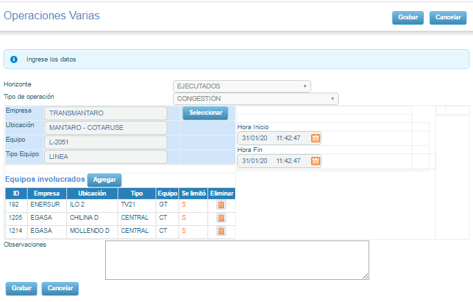
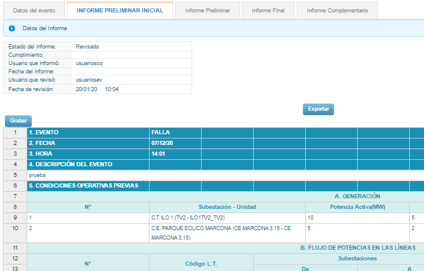
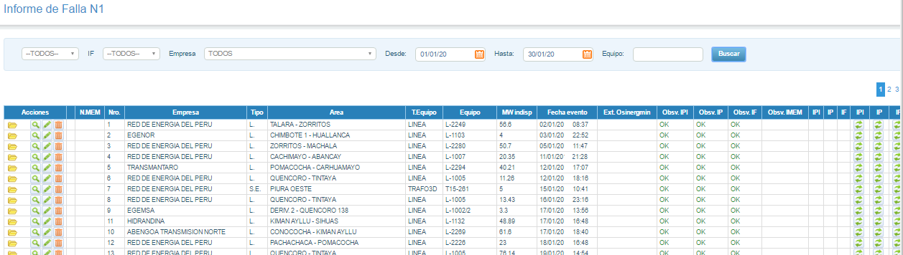
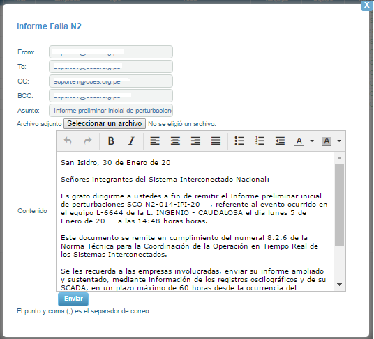

**Migration and Upgrade of Modules from Client-Server (PowerBuilder) to Web (C#, Javascript, MVC and others)**

**Operations**

**Operations - Gas**

**Operations - International Interconnections**

**Operations - Secondary Frequency Reserve**

**Operations - Operational Restrictions**

**Operations - Report**

**Operations - Congestion**

**Operations - Copied**

**Random Tests**

**Random Tests - Detail**

**Random Tests - Mail**

**Send Mail**

**Send Mail - Detail**

**Send Mail - Mail**

**Failure Report - Detail 1**

**Failure Report - Detail 2**

**Failure Report**

**Report N1**

**Report N1 - Detail**

**Report N1 - Mail**

**Report N2**

**Report N2 - Detail**

**Report N2 - Mail**

