**Development of the application for the evaluation process of the cold reserve units and the Southern Energy Node**

**Main**

**Cold Reserve - Main**

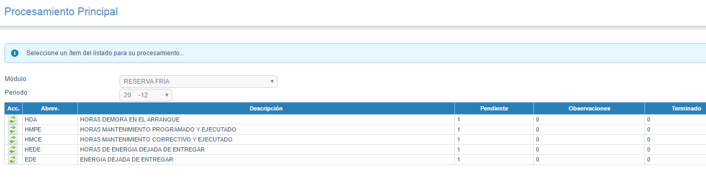

**Cold Reserve - Report**

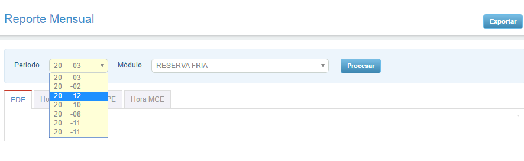

**Cold Reserve - Report Detail 1**

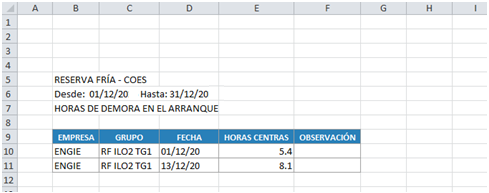

**Cold Reserve - Report Detail 2**

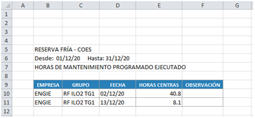

**Cold Reserve - Manual Registration**

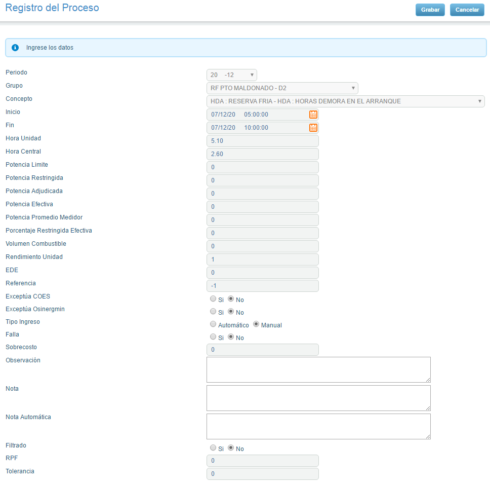

**Cold Reserve - Set Point Power**

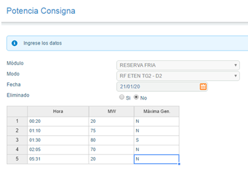

**Energy Node - Main**

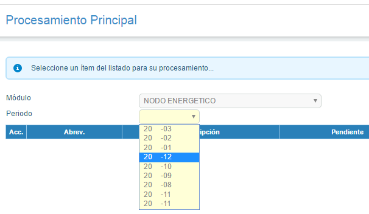

**Energy Node - Detail 1**

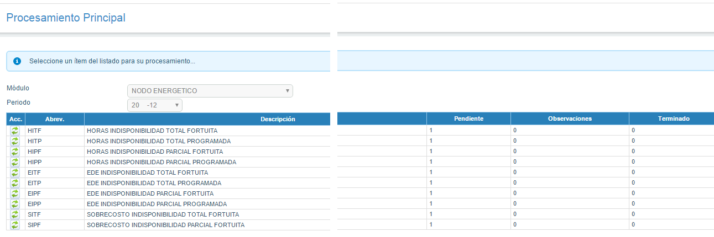

**Energy Node - Detail 2**

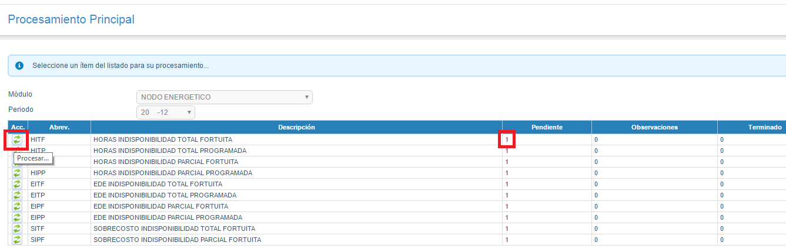

**Energy Node - Report**

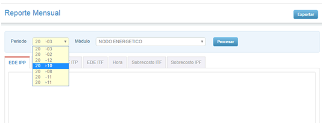

**Energy Node - Hours Report**

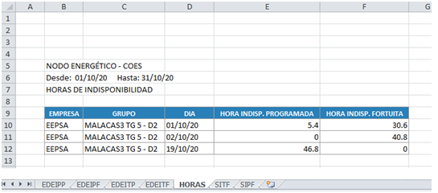

**Energy Node - Cost Overrun Report**

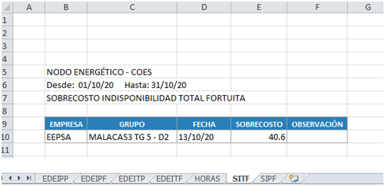

**Energy Node - Record**

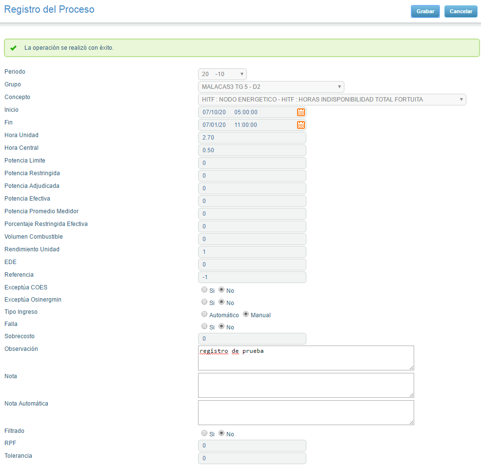
